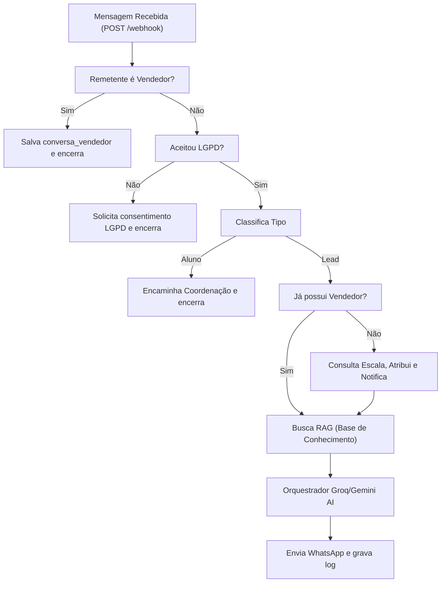

# Diagnóstico de Alto Nível — Sistema Rastro Boot & CRM WhatsApp

Este documento apresenta a análise de arquitetura, status de componentes, pontos de risco e recomendações para os projetos **Rastro Boot** (Backend) e **CRM WhatsApp** (Frontend).

---

## 1. Mapa de Arquitetura

O diagrama abaixo ilustra o fluxo de dados em alto nível e as conexões entre o cliente, os provedores de WhatsApp, a inteligência artificial, o banco de dados Supabase e o painel CRM.

---

## 2. Status de Cada Componente

Abaixo está a classificação do estado de funcionamento de cada arquivo e módulo principal dos dois projetos:

### RASTRO_BOOT (Backend)

*   **`index.js` (Express Server)** — ⚠️ **Funcionando com problemas**
    *   *O que faz*: Centraliza o roteamento de webhooks (Meta/Z-API), gerencia as chamadas às LLMs (Groq/Gemini), o fluxo de qualificação (RAG factual) e as tarefas em segundo plano (alertas, cron e envio de resumos).
    *   *Motivo do status*: Armazena o estado das conversas, consentimento e atividade em variáveis locais na memória RAM do processo, o que torna o bot suscetível a perdas de contexto e resets indesejados durante reinicializações ou novos deploys do servidor Railway.
*   **`wa-vendedores.mjs` (Baileys Daemon)** — ❌ **Removido**
    *   *O que faz*: Era um daemon para capturar mensagens via biblioteca Baileys.
    *   *Motivo do status*: Removido do projeto, pois os vendedores agora são monitorados e gerenciados via integração com o WANotifier.
*   **`fix-lids.js` (Script Utilitário)** — ✅ **Funcionando**
    *   *O que faz*: Script de manutenção manual para mapear LIDs antigos salvos como telefone direto de volta para números reais no banco de dados Supabase via Z-API.
    *   *Motivo do status*: É um utilitário CLI estático sem dependência de execução contínua, funcionando conforme projetado quando executado.
*   **`check-escala.js` (Script Utilitário)** — ✅ **Funcionando**
    *   *O que faz*: Ferramenta CLI simples usada para validar a lógica de rotação da escala de atendimento dos vendedores cadastrada no banco.
    *   *Motivo do status*: Executa localmente de forma limpa e valida a escala conforme esperado.
*   **`.env` (Configurações)** — ⚠️ **Funcionando com problemas**
    *   *O que faz*: Guarda chaves de APIs, tokens e conexões locais.
    *   *Motivo do status*: O template de desenvolvimento local carece de variáveis cruciais utilizadas pelo servidor em produção (como `META_PHONE_NUMBER_ID` e `META_ACCESS_TOKEN`), dificultando testes e rodagem local.

### CRM-WHATSAPP (Frontend / Banco)

*   **`index.html` (CRM Dashboard)** — ✅ **Funcionando**
    *   *O que faz*: Interface web SPA (Single Page Application) que lê e edita dados no Supabase em tempo real, fornecendo gráficos, simulador do bot e edição da escala de atendimento.
    *   *Motivo do status*: Totalmente funcional, permitindo a administração da escala semanal, visualização de logs RAG e alteração segura de senhas (criptografadas localmente via SHA-256) tanto para administradores quanto para vendedores individuais.
*   **`supabase_create_view_leads_resumo.sql` (Schema do Banco)** — ✅ **Funcionando**
    *   *O que faz*: Cria a view `leads_resumo` no Supabase, que consolida a última mensagem, vendedor humano atribuído, contagens e tipo por telefone.
    *   *Motivo do status*: A query está otimizada e agiliza de forma escalável as consultas do CRM, evitando que o frontend precise ler milhões de linhas da tabela `conversas`.
*   **`check_supabase.js` (Script Utilitário)** — ✅ **Funcionando**
    *   *O que faz*: Realiza testes manuais rápidos de conexão HTTP REST com a tabela de conversas do Supabase.
    *   *Motivo do status*: Executa de forma isolada e valida o retorno REST da API anon sem falhas.

---

## 3. Pontos de Falha ou Risco

### A. Acoplamento Frágil e Volatilidade de Dados (Risco Alto)
*   **Perda de Memória do Bot**: Dados de qualificação dos leads (`dadosLead`), reengajamento enviado e última atividade de conversação estão armazenados na memória RAM do servidor (`index.js`). Em ambientes PaaS como o Railway, restarts frequentes do container ocorrem devido a novos deploys ou inatividade. Isso zera a memória temporária do bot, podendo fazer com que clientes recebam mensagens repetidas de LGPD, tenham seu fluxo de perguntas reiniciado ou que reengajamentos programados de 24h não sejam disparados.
*   **Bloqueio de Número do WhatsApp (+55 21 97912-9143)**: O número principal do Studio Rastro está ativo no aplicativo WhatsApp Business físico no celular. Tentar registrá-lo na Meta Cloud API gera rate limit imediato e impede que o webhook da Meta funcione corretamente para este canal. É necessário habilitar a coexistência ou migrar em definitivo.

### B. Hardcoding e Configurações Rígidas (Risco Médio)
*   **Configurações do CRM e Exclusões na UI**: A lista de números de telefone excluídos (`excluirNumeros`) e definições de vendedores estão hardcodadas em `index.html`. Alterar um número excluído exige editar o arquivo fonte HTML em vez de salvar dinamicamente em uma tabela do banco de dados.
*   **URLs e IPs fixos**: O arquivo `wa-vendedores.mjs` aponta para um IP fixo público (`65.109.128.237`) para a exibição de QR Codes das sessões de WhatsApp. Se o servidor VPS mudar de IP, o sistema de leitura de QR code e vinculação cairá.

### C. Limpeza de Código Morto e Arquivos Temporários (Concluído)
*   **Suporte Z-API**: Removido o parsing legado do Z-API em `index.js`, deixando a aplicação puramente integrada com a Meta Cloud API.
*   **Scripts temporários**: Os arquivos órfãos (`temp_test.js`, `request_code.js`, `check-rebecca.js` e `wa-vendedores.mjs`) foram deletados do repositório.

---

## 4. Recomendações Priorizadas

| Prioridade | Ação | Impacto | Descrição |
| :---: | :--- | :---: | :--- |
| **1** | **Migrar Estado da RAM para Supabase/Redis** | **Altíssimo** | Remover arrays em memória locais de `index.js` e utilizar tabelas específicas (ex: `estado_bot` já criada) ou Redis para guardar o status do lead, histórico RAG temporário e consentimento, evitando resets em redeploys do Railway. |
| **2** | **Resolver Conexão Meta e Ativar Coexistência** | **Alto** | Completar o fluxo de registro do número Studio Rastro na Cloud API via Embedded Signup para ativar a coexistência da Meta (uso no celular + webhooks simultâneos), eliminando o erro de rate limit e ativando o salvamento automático. |
| **3** | **Tabelar Configurações e Exclusões no Supabase** | **Médio** | Mover as listas hardcodadas de `excluirNumeros` e dados estáticos de vendedores do `index.html` para uma tabela de configuração no Supabase, permitindo edição dinâmica e segura pela UI. |
| **4** | **Limpeza e Refatoração de Código Legado** | **Baixo** | Removidos os parsers legados da Z-API e excluídos os arquivos temporários órfãos (`temp_test.js`, `request_code.js`, `check-rebecca.js`, `wa-vendedores.mjs`), deixando o projeto estável. [CONCLUÍDO] |
| **5** | **Implementar Endpoint de Troca de Senha** | **Baixo** | Substituído o alerta de "Não implementado" pela lógica de redefinição de senha para o vendedor conectado e corrigido o hashing de Base64 para SHA-256 em todas as alterações. [CONCLUÍDO] |
