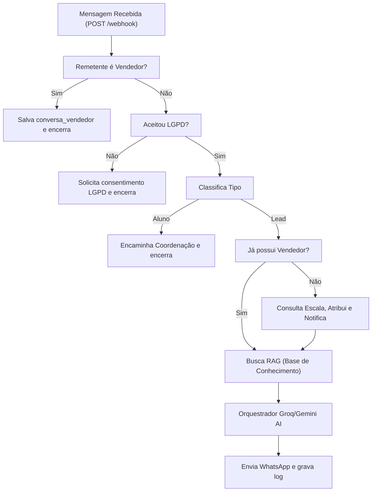

# Fluxograma e Mapeamento de Funções do Projeto

Este documento serve como referência técnica detalhada sobre o funcionamento do ecossistema. Ele contém o fluxograma completo de dados e a descrição de todas as funções, rotas e módulos do **Rastro Boot** (Backend) e do **CRM WhatsApp** (Frontend).

---

## 1. Fluxograma de Dados (Arquitetura)

O diagrama abaixo ilustra como as interações se propagam no sistema, desde a mensagem do cliente até as respostas geradas pela IA e o gerenciamento no painel CRM.

---

## 2. Funções do Backend — `RASTRO_BOOT` (`index.js`)

O backend é um servidor Express executado em Node.js. Ele gerencia APIs, webhooks, lógica de negócio, chamadas de IA e crons em segundo plano.

### A. Endpoints HTTP (API e Webhooks)
*   `GET /` — Health check básico de funcionamento. Retorna `Escola Bot rodando ✅`.
*   `GET /webhook` — Validação do token webhook da Meta Cloud API (retorna o desafio HTTP `hub.challenge`).
*   `POST /webhook` — Processamento de mensagens recebidas pela Meta Cloud API. Extrai textos, detecta intenções, aciona o fluxo de qualificação da IA, notifica vendedores/coordenação e envia respostas via WhatsApp.
*   `POST /webhook-vendedor` — Recebe eventos de mensagens enviadas ou recebidas nos celulares dos vendedores (encaminhadas pela integração do WANotifier) e salva na base de dados com a marcação `conversa_vendedor`.
*   `GET /oauth/callback` — Recebe o código de autorização do Facebook Embedded Signup para geração de tokens de acesso à API Cloud.
*   `POST /simulate` — Rota de testes do CRM que permite conversar com a IA (simulando memória RAM e prompt contextualizado) sem disparar mensagens reais no WhatsApp.
*   `GET /status` — Fornece métricas de integridade ao CRM (modelo de IA ativo, contagem de falhas do dia, horário do último webhook, conversas ativas em cache RAM e uptime do processo).
*   `GET /reset/:telefone` — Limpa o histórico de chat em cache RAM de um número específico.
*   `GET /reset-all` — Limpa o cache RAM de todas as conversas do servidor.
*   `GET /buscar/:telefone` — Busca registros das últimas 50 mensagens enviadas e recebidas de um número diretamente do Supabase.
*   `GET /classificar-antigos` — Inicia um processamento em segundo plano para ler conversas inativas há mais de 30 dias e classificá-las como `perdido` ou `pausado` via IA.
*   `GET /processar-novos` — Dispara o envio de prompts de atualização de status para os vendedores ativos.
*   `GET /relatorio-mensal` — Fornece um endpoint manual para rodar o agendamento de relatório gerencial mensal.

### B. Lógica de Atendimento, Distribuição e RAG
*   `getEscala()` — Lê a tabela `escala_vendedores` do Supabase e gerencia um cache em memória de 5 minutos para evitar requisições repetitivas.
*   `getVendedor()` — Resolve qual vendedor deve receber o lead com base na escala de dia/horário de Brasília e lida com paridades de sábado e fallback rotativo em caso de sobreposição.
*   `getVendedorDoTelefone(telefone)` — Verifica no histórico do banco se o cliente já possui um vendedor fixo associado para manter o mesmo atendimento. Se for novo, atribui o vendedor do horário atual.
*   `getBaseConhecimento()` — Lê a tabela `base_conhecimento` do Supabase (com cache de 10 minutos) contendo fatos factuais da escola de idiomas.
*   `stemPortugues(palavra)` — Função auxiliar que remove sufixos gramaticais e plurais de palavras em português para facilitar a busca keyword no banco.
*   `buscarRAG(mensagem)` — Pontua e seleciona as entradas mais relevantes da base de conhecimento com base nas palavras-chave contidas nas últimas mensagens do cliente, injetando os fatos correspondentes no prompt de sistema da IA.
*   `askAI(telefone, mensagem)` — Orquestrador de mensagens para IA. Tenta chamar o modelo Groq (`llama-3.3-70b-versatile`) usando a chave principal, chave reserva em caso de rate limit, e faz o fallback final para a API do Gemini (`gemini-2.5-flash`) caso todas as anteriores falhem.
*   `askGroq(...)` / `askGemini(...)` — Wrappers de conexão com as respectivas APIs de NLP.

### C. Lógica de Envio de Mensagens e Notificações
*   `sendWhatsApp(telefone, mensagem)` — Gerencia uma fila global de envio de mensagens de texto no WhatsApp com atraso mínimo de 5 segundos entre mensagens para evitar bloqueios da Meta.
*   `sendTemplate(telefone, templateName, variables)` — Envia mensagens formatadas em templates homologados da API Meta Business Cloud.
*   `notificarVendedor(telefone, vendedor)` — Dispara o template `notificacao_novo_lead` com o nome, turma e telefone do lead qualificado para o celular do vendedor atribuído.
*   `notificarCoordenacao(telefone)` — Envia o template `alerta_coordenacao` alertando a coordenação que um aluno já matriculado está aguardando atendimento.
*   `salvarMensagem(telefone, mensagem, de, vendedor, tipo)` — Realiza a persistência das mensagens no Supabase na tabela `conversas`.
*   `getHistorico(telefone)` — Reconstrói o histórico da conversa em cache RAM a partir dos dados do banco para alimentar o histórico do chat da IA na sessão atual.
*   `verificarConsentimento(telefone)` — Checa se o cliente possui registros anteriores de conversa no Supabase para pular ou exibir a notificação de conformidade com a LGPD.

### D. Agendamentos e Rotinas (Cron)
*   `checkInatividade()` — Roda a cada 30 minutos. Varre conversas paradas há 24h para disparar templates de reengajamento (`reengajamento_inicial`, `reengajamento_com_nome` ou `reengajamento_confirmacao`).
*   `enviarResumoDiario()` — Compila todos os leads do dia anterior, conversões, status e envia um relatório detalhado via WhatsApp para a gerente.
*   `agendarResumoDiario()` — Agenda a execução do resumo diário todos os dias às 8h BRT.
*   `agendarLembreteEscala()` — Envia um template de lembrete de escala para a gerente toda sexta-feira às 19h BRT.
*   `checkLeadsPausados()` — Dispara um template de lembrete para o vendedor quando um lead agendado como `pausado` atinge a data de retorno configurada.
*   `classificarLeadsAntigos()` — Automatiza a expiração e limpeza de leads inativos há mais de 30 dias mudando o status para perdido no Supabase.
*   `enviarAlertaVendedor(nome, numero)` — Monta a fila de leads recentes pendentes de atualização para um vendedor específico e dispara o template interativo.
*   `processarBacklogNovos()` — Orquestra a rodagem em lote de alertas e limpezas a cada 24h.
*   `gerarRelatorioMensal()` — Consolida todas as métricas do mês anterior, extrai amostras de conversas e envia um prompt analítico via OpenRouter para gerar um relatório gerencial em texto enviado diretamente no WhatsApp da gerente.

---

## 3. Funções do Frontend — `CRM-WHATSAPP` (`index.html`)

O frontend é um painel de controle executado inteiramente no navegador do usuário, com layout construído em HTML/CSS e a lógica de exibição, gráficos e conexões em Javascript.

### A. Autenticação e Segurança (Local)
*   `sha256(str)` — Helper utilitário que recebe uma string e retorna seu hash SHA-256 codificado em hexadecimal para segurança de login.
*   `fazerLogin()` — Valida o usuário e senha inseridos na tela de login computando o SHA-256 e comparando-o com os dados salvos em `localStorage`. Caso coincidam, inicializa a sessão e salva as credenciais temporariamente no `sessionStorage`.
*   `logout()` — Limpa os dados de sessão do `sessionStorage` e recarrega a página.
*   `saveVendedorPassword()` — Permite que o vendedor mude sua própria senha logada. Valida a confirmação, calcula o SHA-256 e persiste as novas credenciais de acesso no `localStorage`.
*   `saveAdminPasswords()` — Permite ao Administrador redefinir a senha de qualquer vendedor ou do próprio administrador, salvando os novos hashes de forma persistente.

### B. Inicialização e Atualizações
*   `initDomCache()` — Faz o caching dos seletores JavaScript das tags HTML no objeto de controle `dom` para acelerar manipulações de interface.
*   `showView(view)` — Alterna as abas visualizáveis da aplicação (Dashboard, Leads, Relatórios, Bot IA, Configurações) aplicando reajustes de layout.
*   `applyRoleUI()` — Oculta ou exibe cards, botões de exportação, seletores de escala e abas do menu lateral dependendo da permissão do usuário logado (Admin visualiza tudo, Vendedores visualizam apenas seus próprios dados).
*   `loadAllData()` — Dispara consultas assíncronas assíncronas ao banco de dados Supabase via requisições REST (`fetch`) para atualizar os cards de métricas, as conversas ativas e o gráfico semanal.
*   `updateClock()` — Mantém o relógio do topo do painel atualizado no horário local.

### C. Gestão de Chats e Leads
*   `loadConversas(today, history)` — Recebe as mensagens lidas do Supabase, agrupa-as por número e vendedor associado, remove números excluídos, define se são leads/alunos/prospecções e renderiza a lista de conversas recentes do painel.
*   `showConv(conv, element)` — Abre os detalhes de uma conversa e exibe o histórico completo de mensagens na área de chat, identificando o autor (bot, cliente, vendedor).
*   `loadLeadHistory(telefone)` — Consulta a tabela de auditoria `historico_leads` no Supabase e exibe em uma linha do tempo (timeline) todas as alterações manuais sofridas pelo lead (mudança de status, anotações, interesse, idade, etc.).
*   `saveLeadModal()` — Salva anotações adicionais do lead, idade, nome e altera o seu status do CRM (realizando INSERT/UPDATE na tabela `status_de_leads`).
*   `loadLeadsView()` — Carrega e exibe a tabela principal da aba de Leads, aplicando filtros de busca por nome/telefone, período de cadastro, vendedor e status.

### D. Relatórios e Métricas
*   `loadRelatorios()` — Consolida dados agregados do período selecionado e calcula o total de mensagens, leads capturados por bot vs vendedor humano e preenche a tabela de ranking de performance.
*   `renderLineChart(...)` — Desenha de forma dinâmica uma linha de tendência do volume diário de novos leads em formato gráfico SVG.
*   `renderHeatmap(...)` — Cria um mapa de calor interativo de 7 dias da semana por 14 faixas de horários para expor os picos de maior recebimento de mensagens.
*   `loadVendorsReport()` — Cria os cards de desempenho individual dos vendedores mostrando conversão em porcentagem, total de leads atendidos, tempo médio de resposta e a data da última atividade.
*   `exportReportExcel(btn)` / `exportVendorsReportExcel()` — Coleta as linhas de leads ou dados de performance exibidos e gera arquivos de planilhas `.xlsx` em lote utilizando a biblioteca SheetJS.

### E. Configurações do Sistema
*   `loadMasterScale()` — Lê e exibe a escala de atendimento em turnos (Manhã, Tarde, Noite, Sábado) para os dias da semana.
*   `saveMasterScale()` — Salva as alterações da escala semanal feitas pelo Admin de volta na tabela `escala_vendedores` no Supabase.
*   `loadBaseConhecimento()` — Renderiza a tabela da base de conhecimento (RAG fact-check) para o bot.
*   `saveBaseEntry()` / `deleteBaseEntry(id)` — Adiciona, edita ou deleta regras factuais que mudam o comportamento de respostas do robô de IA.
*   `addExclusionNumber()` — Permite adicionar números na lista de exclusão do CRM para filtrar números de testes ou spam.

### F. Simulador do Bot IA
*   `simulateResponse()` — Captura o texto escrito na área do simulador da aba Bot IA e o envia em uma chamada HTTP POST para o endpoint `/simulate` do servidor do Railway. Exibe a resposta recebida, o modelo de processamento utilizado e a categoria detectada.
*   `loadBotIAView()` — Executa consultas ao endpoint `/status` do servidor bot Express para expor as métricas de saúde da IA ativas no Railway.
